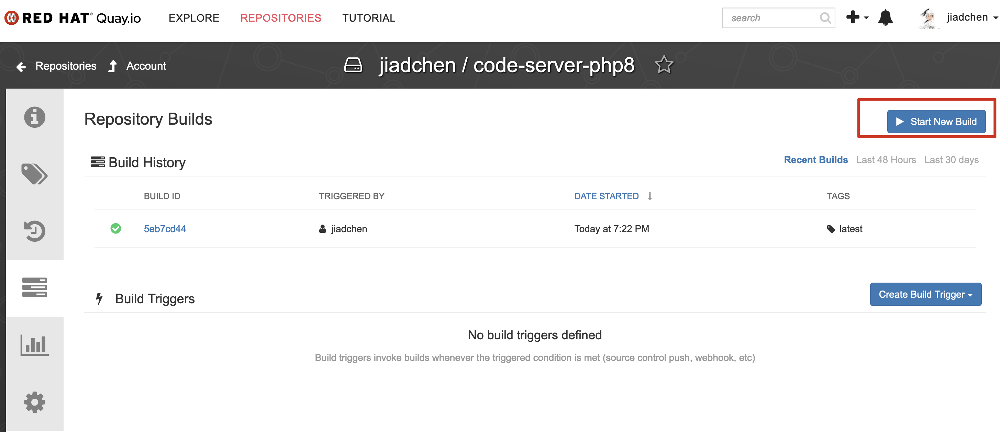

詳細な構築方法は下記記事にまとめた。  
https://rheb.hatenablog.com/entry/2022/09/13/152350

# nodejs-servers
node 16 の code-serverイメージを作成
```
cd code-server/nodejs-servers
podman build --format docker --layers=false -t code-server-nodejs16:latest .
```

code-serverのコンテナを起動
```
cd code-server/nodejs-servers
podman-compose -f code-server.yml up -d
```

# python-servers
python 3.10 の code-serverイメージを作成
```
cd code-server/python-servers
podman build --format docker --layers=false -t code-server-python3:latest .
```

code-serverのコンテナを起動
```
cd code-server/python-servers
podman-compose -f code-server.yml up -d
```

openshiftにデプロイするために、containerファイルをquay.ioにアップロードしてquay.ioにbuildしてもらう必要がある  
なぜなら、MacOSでビルドしたイメージはarm用のものになっているので、openshift上で使えない可能性があります。quay.ioにビルドしてもらったほうが安全。  
もしくはquay.ioをgithubとリンクづければいい。


openshiftのweb terminalで下記コマンドを実行してcode-serverのrouteを作る
```
oc project code-server
oc expose svc/<service-name>
```

# php-servers
php の code-serverイメージを作成
```
cd code-server/php-servers
podman build --format docker --layers=false -t code-server-php8:latest .
```

code-serverのコンテナを起動
```
cd code-server/php-servers
podman-compose -f code-server.yml up -d
```

## code-serverをブラウザで開いた後に下記環境構築作業を行う
code-server learn-clean-architecture/api/laravel10.x/
touch database.sqlite
composer install
composer unit-test
composer serve
composer api-test

`/etc/php/8.2/cli/conf.d/20-xdebug.ini`の中身を下記に入れ替える（vscodeでxdebugを使うため）
```
; ここではコメントアウトで無効化しておいて、実行時にvscode側から有効化します
;zend_extension = "xdebug.so"

; 下記は常時設定しておきます
xdebug.client_host = 127.0.0.1
xdebug.client_port = "9003"
xdebug.mode = debug
xdebug.idekey = "PHPSTORM"
xdebug.start_with_request = yes
```

## 初期準備
Themeを黒の方に変更
```
git clone https://github.com/coolboy0961/react-typescript-fastapi-postgresql.git
code-server react-typescript-fastapi-postgresql/backend
export PIPENV_VENV_IN_PROJECT=true && pipenv --python 3.10
pipenv run sync
```
python環境がプロジェクトのvenvになっているかチェック
Test Explorerにテストケースが表示されているかチェック
unit-testを単独実行できるかチェック
unit-testをdebugできるかチェック
```
pipenv run unit-test
pipenv run start
pipenv run api-test
```

# code-server 操作方法
dirAもしくはdirBをworkspaceとして開く場合、下記コマンドを実行する
```
code-server ./dirA # opens ./dirA
code-server ./dirB # opens ./dirB
```

